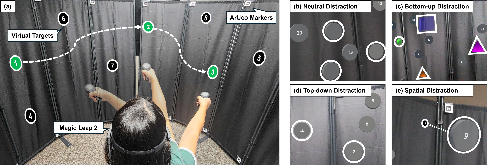

# AR-TMT

This is the official code repository for the paper to be presented at ACM VRST 2025, titled "**AR-TMT: Investigating the Impact of Distraction Types on Attention and Behavior in AR-based Trail Making Test**", authored by Sihun Baek, Zhehan Qu, Maria Gorlatova. [video link](https://youtu.be/-CHhz_t5S40)


---

## Overview

Despite the growing use of AR in safety-critical domains, the field lacks a systematic understanding of how different types of distraction affect user attention in AR environments. To address this gap, we present **AR-TMT**, an AR adaptation of the Trail Making Test that spatially renders targets for sequential selection on the Magic Leap 2. We implemented distractions in three categories: top-down, bottom-up, and spatial distraction based on Wolfe's Guided Search model, and captured performance, gaze, motor behavior, and subjective load measures to analyze attention and behavior.

---
## Video Demonstration

Check the video below for demoonstration of AR-TMT. It includes all the stages of AR-TMT that we implmeneted.
[The link](https://youtu.be/-CHhz_t5S40)

---
## AR-TMT Implementation

*The source code of AR-TMT is available [**here**](Assets/Scripts/AR-TMT)*.  AR-TMT containts the following scripts: 
```
Scripts/AR-TMT
└───SharedInfomanager.cs    ## Main script to manage the overall AR-TMT flow. 
└───ShootingAction_controler.cs ## shooting action controller 
└───TargetGenerator.cs  ## Targets and Distractor generator 
└───EyeTrackerLogger.cs  ## Eye tracking data logger
└───DataTranmission.cs   ## Data transmission function to a local computer  
└───MarkerDetection.cs     ## Aruco Marker Detector to initiate and locate the AR-TMT test     
└───NoticeHandler.cs    ## Stage Description UI handler
└───SelectionNoticeHandler.cs   ## Main Selection UI handler
└───PlaneDetectionMarker.cs  ## Aruco Marker Detector for panel detection
└───MotorSpeed Test ## VisuoMotorSpeed Test
└───MLcameraTest ## Egocentric Video Recorder
└───Questionnaire ## After-stage ratings

```

---
## Citation

If you use this work, please cite:
```
@article{baek2025ar, 
title={AR-TMT: Investigating the Impact of Distraction Types on Attention and Behavior in AR-based Trail Making Test}, author={Baek, Sihun and Qu, Zhehan and Gorlatova, Maria}, 
journal={arXiv preprint arXiv:2509.13468}, year={2025} }
```

---


## Contact

For questions or collaboration, contact:  
**Sihun Baek**  
sihun.baek@duke.edu  
Department of Electrical and Computer Engineering, Duke University

---


## Acknowledgements

We thank the study's participants for their time in the data collection. This study was done in the [Intelligent Interactive Internet of Things Lab](https://gorlatova.pratt.duke.edu/) at [Duke University](https://www.duke.edu/), and was approved by our institution's Institutional Review Board.  

The authors of this repository are [Sihun Baek](https://gorlatova.pratt.duke.edu/people/sihun-baek), [Zhehan Qu](https://scholars.duke.edu/person/zhehan.qu), and [Maria Gorlatova](https://maria.gorlatova.com/). Contact Information of the authors: 
* Sihun Baek (sihun.baek AT duke.edu)
* Zhehan Qu (zhehan.qu AT duke.edu)
* Maria Gorlatova (maria.gorlatova AT duke.edu)

This work was supported in part by NSF grants CSR-2312760, CNS-2112562, and IIS-2231975, NSF CAREER Award IIS-2046072, NSF NAIAD Award 2332744, a Cisco Research Award, a Meta Research Award, Defense Advanced Research Projects Agency Young Faculty Award HR0011-24-1-0001, and the Army Research Laboratory under Cooperative Agreement Number W911NF-23-2-0224. The views and conclusions contained in this document are those of the authors and should not be interpreted as representing the official policies, either expressed or implied, of the Defense Advanced Research Projects Agency, the Army Research Laboratory, or the U.S. Government. This paper has been approved for public release; distribution is unlimited. No official endorsement should be inferred. The U.S.~Government is authorized to reproduce and distribute reprints for Government purposes notwithstanding any copyright notation herein.

