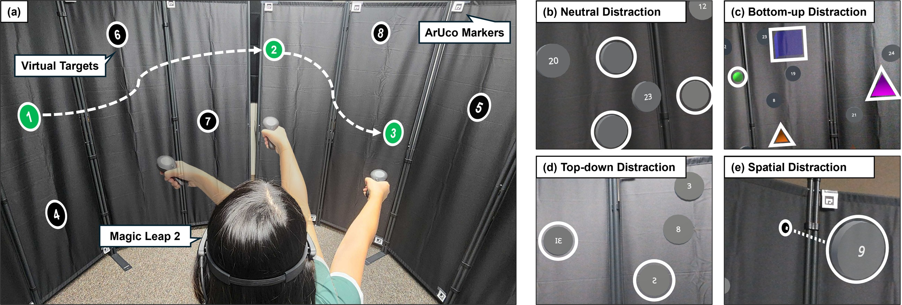

<div align="center">

# AR-TMT

### Investigating the Impact of Distraction Types on Attention and Behavior in AR-based Trail Making Test

[](https://vrst.hosting.acm.org/vrst2025/)
[](https://arxiv.org/abs/2509.13468)
[](https://youtu.be/-CHhz_t5S40)
[](https://unity.com/releases/editor/whats-new/2022.3.48)
[](https://www.magicleap.com/magic-leap-2)

[**Sihun Baek**](https://gorlatova.pratt.duke.edu/people/sihun-baek) · [**Zhehan Qu**](https://scholars.duke.edu/person/zhehan.qu) · [**Maria Gorlatova**](https://maria.gorlatova.com/)

[Intelligent Interactive Internet of Things (I³T) Lab](https://gorlatova.pratt.duke.edu/) · Duke University

This is the official code repository for the ACM VRST 2025 paper<br>
"**AR-TMT: Investigating the Impact of Distraction Types on Attention and Behavior in AR-based Trail Making Test**"

</div>

---

## 🔍 Overview



Despite the growing use of AR in safety-critical domains, the field lacks a systematic understanding of how different types of distraction affect user attention in AR environments. To address this gap, we present **AR-TMT**, an AR adaptation of the Trail Making Test that spatially renders targets for sequential selection on the **Magic Leap 2**.

- 🎯 **AR Trail Making Test** — virtual targets are spatially anchored with ArUco markers and selected in sequence
- 🧠 **Three distraction categories** — top-down, bottom-up, and spatial distraction, grounded in Wolfe's Guided Search model
- 👁️ **Rich behavioral sensing** — task performance, eye gaze, motor behavior, and subjective load measures
- 📡 **Live data pipeline** — real-time data transmission and egocentric video recording for offline analysis

## 🎬 Video Demonstration

The video below demonstrates all the stages of AR-TMT that we implemented — click to watch:

<div align="center">

[](https://youtu.be/-CHhz_t5S40)

</div>

## 🗂️ AR-TMT Implementation

The source code of AR-TMT is available in [`Assets/Scripts/AR-TMT`](Assets/Scripts/AR-TMT), organized as follows:

```
Assets/Scripts/AR-TMT
├── SharedInfomanager.cs          # Main script managing the overall AR-TMT flow
├── TargetGenerator.cs            # Target and distractor generator
├── ShootingAction_controler.cs   # Shooting (target-selection) action controller
├── EyeTrackerLogger.cs           # Eye-tracking data logger
├── DataTranmission.cs            # Data transmission to a local computer
├── MarkerDetection.cs            # ArUco marker detector to initiate and locate the test
├── PlaneDetectionMarker.cs       # ArUco marker detector for panel detection
├── NoticeHandler.cs              # Stage-description UI handler
├── SelectionNoticeHandler.cs     # Main selection UI handler
├── MotorSpeedTest/               # Visuomotor speed test
├── MLcameraTest/                 # Egocentric video recorder
├── Questionnaire/                # After-stage subjective ratings
├── WebRTC/                       # Real-time audio/video streaming
└── Prefab_file/                  # Target and distractor prefabs & visual effects
```

## 🚀 Getting Started

| Requirement | Version |
|---|---|
| Unity | 2022.3.48f1 |
| Magic Leap Unity SDK | 2.5.0 (embedded in [`Packages/`](Packages/)) |
| Device | Magic Leap 2 |

1. Clone this repository and open the project with Unity 2022.3.48f1.
2. Open the main scene: [`Assets/Scenes/AR-TMT.unity`](Assets/Scenes/AR-TMT.unity).
3. Build for the Android (Magic Leap 2) platform and deploy to the device.

## 📄 Citation

If you use this work, please cite:

```bibtex
@article{baek2025ar,
  title   = {AR-TMT: Investigating the Impact of Distraction Types on Attention and Behavior in AR-based Trail Making Test},
  author  = {Baek, Sihun and Qu, Zhehan and Gorlatova, Maria},
  journal = {arXiv preprint arXiv:2509.13468},
  year    = {2025}
}
```

## ✉️ Contact

For questions or collaboration, please reach out to the authors:

- **Sihun Baek** — sihun.baek (AT) duke.edu
- **Zhehan Qu** — zhehan.qu (AT) duke.edu
- **Maria Gorlatova** — maria.gorlatova (AT) duke.edu

## 🙏 Acknowledgements

We thank the study's participants for their time in the data collection. This study was done in the [Intelligent Interactive Internet of Things Lab](https://gorlatova.pratt.duke.edu/) at [Duke University](https://www.duke.edu/), and was approved by our institution's Institutional Review Board.

This work was supported in part by NSF grants CSR-2312760, CNS-2112562, and IIS-2231975, NSF CAREER Award IIS-2046072, NSF NAIAD Award 2332744, a Cisco Research Award, a Meta Research Award, Defense Advanced Research Projects Agency Young Faculty Award HR0011-24-1-0001, and the Army Research Laboratory under Cooperative Agreement Number W911NF-23-2-0224. The views and conclusions contained in this document are those of the authors and should not be interpreted as representing the official policies, either expressed or implied, of the Defense Advanced Research Projects Agency, the Army Research Laboratory, or the U.S. Government. This paper has been approved for public release; distribution is unlimited. No official endorsement should be inferred. The U.S. Government is authorized to reproduce and distribute reprints for Government purposes notwithstanding any copyright notation herein.
